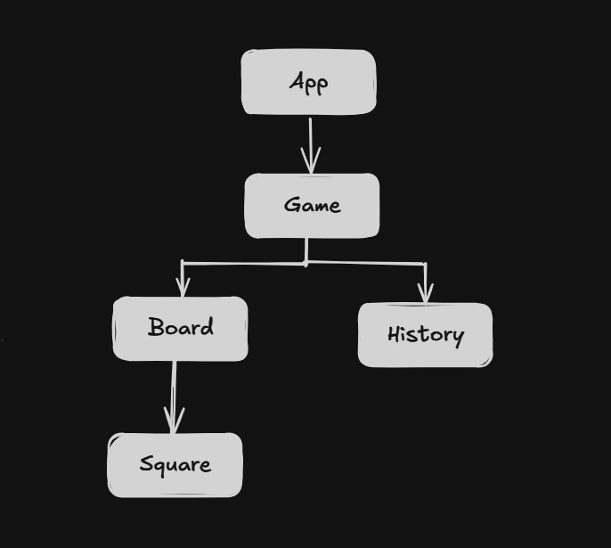

# Tic Tac Toe — React Project

A simple and interactive Tic Tac Toe game built using React.
This project focuses on clean component structure, state management, and the core logic behind building a turn-based game.
It is beginner-friendly and demonstrates how React handles UI updates, game flow, and reusable components.

---

## Live Demo

Add your deployed link here
`https://your-demo-link.vercel.app`

<br></br>

## Component Hierarchy

(Add your component hierarchy diagram or screenshot here)

```

```

<br></br>

## Features

- Two-player Tic Tac Toe game
- Highlights the winner
- Draw detection
- Game history (time travel)
- Fully interactive board built with React state

<br></br>

## What I Learned

1. **Lifting State Up**
   I learned one of the most common and important React design patterns: **lifting state up**.
   While building this project, I applied this pattern by lifting the state from the child component (Board) up to the parent component (Game). This allowed me to control the child components from the parent level.

   In React, state is a component’s personal memory. It only contains information related to that specific component and cannot directly interact with the state of other components. Since props only work in a parent-to-child direction, sibling components cannot naturally share data.

   Lifting state up solves this problem, it allows multiple components to share the same state through their common parent. Once the parent component holds the state, it becomes accessible to all child components through props. This helped me understand React’s data flow and how shared logic should be managed.

<br/>

2. **Understanding History and Time Travel**
   Another major learning was handling the **history** feature. It stores the entire board state every time a player makes a move. At first, this concept felt confusing, but after practicing it a few times, it started to make sense.

   This approach helped me understand how to implement features like undo and redo by using previous states. It was a valuable experience, and it will definitely help me in future projects that require state tracking or time-travel functionality.

<br></br>

## Tech Stack

- React
- JavaScript (ES6+)
- CSS (Tailwind)
- Vite

<br></br>

## Getting Started

### Clone the repository

```
git clone https://github.com/aponroy0/tic-tac-toe-react.git
```

### Install dependencies

```
npm install
```

### Run the project

```
npm run dev
```

<br></br>

## How It Works

- The game board is rendered as a collection of Square components
- State is managed at the Game level
- Each click updates the board state and switches players
- Winning patterns are checked after every move
- The UI updates instantly through React’s re-rendering mechanism

<br></br>
